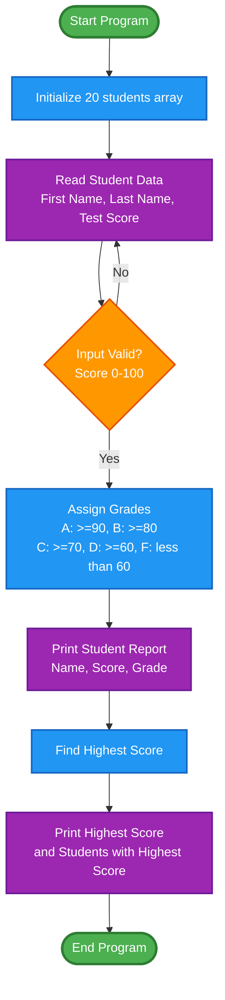

# Student Grading System

A C++ program that manages student academic records, automatically assigns letter grades based on test scores, and identifies top-performing students.

## Overview

This program demonstrates the implementation of structured data types in C++ by managing academic records for 20 students. It processes student information, assigns letter grades based on standardized scoring thresholds, and generates comprehensive reports with statistical analysis.

## Features

- **Data Input with Validation**: Robust input handling with error checking for valid score ranges (0-100)
- **Automatic Grade Assignment**: Converts numerical scores to letter grades based on standard academic scales
- **Comprehensive Reporting**: Generates formatted student records with names, scores, and grades
- **Statistical Analysis**: Identifies and displays the highest test score and top-performing students
- **Error Recovery**: Handles invalid input gracefully with user-friendly error messages

## Program Structure

### Data Structure

```cpp
struct studentType {
    string studentFName;    // Student's first name
    string studentLName;    // Student's last name
    int testScore;          // Test score (0-100)
    char grade;             // Letter grade (A-F)
};
```

### Core Functions

| Function | Purpose |
|----------|---------|
| `readStudentData()` | Reads and validates student information from user input |
| `assignGrades()` | Assigns letter grades based on numerical scores |
| `findHighestScore()` | Determines the highest test score in the class |
| `printHighestScorers()` | Displays students who achieved the highest score |
| `printStudentData()` | Generates formatted report of all student records |

## Grading Scale

| Score Range | Letter Grade |
|-------------|--------------|
| 90 - 100    | A            |
| 80 - 89     | B            |
| 70 - 79     | C            |
| 60 - 69     | D            |
| 0 - 59      | F            |

## How It Works



## Compilation and Execution

### Using CMake (Recommended)

```bash
mkdir build
cd build
cmake ..
make
./tugas_struct_dan_union
```

### Using g++ directly

```bash
g++ -std=c++11 -o grading_system tugas_struct_dan_union.cpp
./grading_system
```

## Usage Example

### Input Format

```
Enter data for 20 students:
Format: FirstName LastName TestScore
----------------------------------------
Student 1: John Doe 95
Student 2: Jane Smith 88
Student 3: Alice Johnson 92
...
```

### Sample Output

```
============================================================
STUDENT GRADE REPORT
============================================================
Student Name             Test Score     Grade
------------------------------------------------------------
Doe, John                95             A
Smith, Jane              88             B
Johnson, Alice           92             A
...
============================================================

Highest Test Score: 95

Students having the highest test score:
Doe, John
```

## Technical Details

- **Language**: C++11 or higher
- **Standard Library Dependencies**: `<iostream>`, `<string>`, `<iomanip>`
- **Data Structure**: Array of structs
- **Input Validation**: Score range checking (0-100)
- **Time Complexity**: O(n) for all operations
- **Space Complexity**: O(n) where n = 20 students

## Key Programming Concepts

- **Structured Data Types**: Use of `struct` to group related data
- **Modular Design**: Separation of concerns through distinct functions
- **Input Validation**: Defensive programming with error handling
- **Formatted Output**: Use of I/O manipulators (`setw`, `left`)
- **Const Correctness**: Read-only parameters marked as `const`
- **Array Processing**: Iteration and manipulation of structured arrays

## Error Handling

The program includes comprehensive error handling:

- Validates numeric input for test scores
- Checks score range (0-100)
- Clears input stream on errors
- Provides clear error messages to users
- Loops until valid input is received

## Academic Context

This C++ program demonstrates a structured approach to managing student academic records through the implementation of a grading system for 20 students. The core of the design lies in the `studentType` structure, which encapsulates student information including names, test scores, and letter grades, representing a fundamental application of data abstraction in procedural programming. The program's architecture follows a modular design pattern with five specialized functions that handle distinct responsibilities: data input with validation, grade assignment based on standard academic thresholds, maximum score identification, top performer reporting, and formatted output generation. The `readStudentData()` function employs defensive programming techniques by validating input ranges and recovering from stream errors, ensuring data integrity throughout the process. Grade assignment utilizes a cascading conditional structure that maps numerical scores to letter grades (A through F), while the score analysis functions implement linear search algorithms to identify the highest achievers. The program flow proceeds systematically from initialization through data collection, processing, and presentation, culminating in a professionally formatted report that displays individual student records alongside statistical highlights. This implementation effectively demonstrates essential programming principles including structured data types, algorithmic thinking, error handling, and formatted I/O operations, making it a solid example of well-organized C++ code that balances functionality with readability and maintainability.

## License

This project is created for academic purposes as part of the Pemrograman Dasar course.

## Author

**Course**: Pemrograman Dasar (Fundamental Programming)
**Semester**: 7
**Academic Year**: 2025
**Topic**: Struct and Union
